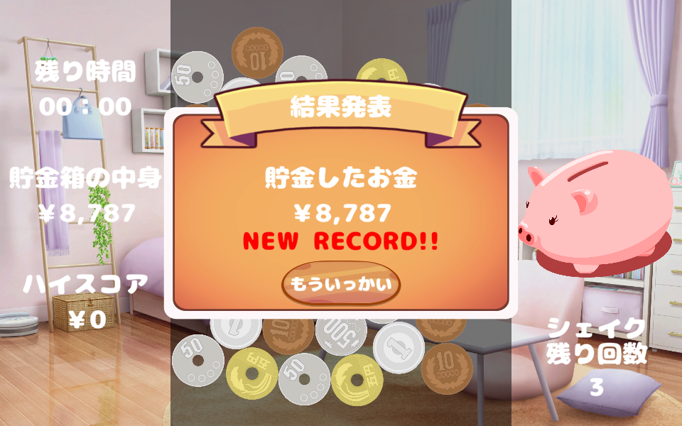

# Money Tsum
・ゲーム開始時画面   
</img>      

・タイトル画面   
</img>    

・ゲーム画面   
</img>  

・リザルト画面   
</img> 

以下URLからプレイできます。   
https://atsushi-w.github.io/BalanceGame/   

# ゲーム説明   
お金をつなげて貯金(残高)を増やそう！   
硬貨は特定の枚数をつなぐことで両替することができるぞ！   
※1円玉を5枚つなぐと5円玉、5円玉2枚で10円玉...   

# 操作説明
</img>     
硬貨をマウス左クリックすることで選択、ドラッグで同じ硬貨同士であればつなげることができます。   
離すと条件を満たしていれば消去し、満たしていない場合は選択が解除されます。   
消去した硬貨の価値と枚数でスコアが加算されます。例：100円玉3枚だと300点加算   
基本的に硬貨は3枚以上つなげると消すことができます。※一部2枚以上で消せる硬貨もあります   
硬貨は一定枚数つなげて消すと硬貨を1枚生成します。   
1円玉 → 5枚以上で5円玉   
5円玉 → 2枚以上で10円玉   
10円玉 → 5枚以上で50円玉   
50円玉 → 2枚以上で100円玉   
100円玉 → 5枚以上で500円玉   

また、マウスを右クリックすることで、硬貨が入っている画面をシェイクすることができます。   
シェイクできる回数は1ゲーム中で3回まで、回数が0の状態では右クリックしてもシェイクすることはできません。   

# 制作環境
Unity 2021.3.29f1

# 制作テーマと注意事項
・テーマ：「バランス」   
・制作期間は1ヵ月(10/31まで)   

# 制作テーマの解釈
・Balance(バランス)の意味は釣り合い、均衡や調和といった同じように分配するような意味を持つが、   
　銀行の用語でBalanceは「残高」という意味を持つ   
・残高を増やす→お金を積む、から連想して硬貨を用いたツムツム風ゲームにする   
　→硬貨をつなげて両替して、貯金箱に詰め込む(残高を増やす)   

# 仕様書
・操作はマウスクリック(左クリック)とドラッグのみ   
・クリックし続けると選択状態となり、同じ硬貨同士であればつなぐことができる   
・同じ硬貨を3枚以上つなげると消すことができる   
・1円玉、10円玉、100円玉は5枚つなげると消したあとに硬貨を生成する   
　1円玉→5円玉、10円玉→50円玉、100円玉→500円玉   
・5円玉と50円玉は特殊で2枚以上つなげると消すことができ、硬貨を生成する   
　5円玉→10円玉、50円玉→100円玉   
・スコアは消した硬貨によって加算(1円玉は1枚につき1点、100円玉は1枚につき100点など)   
・制限時間に達したらリザルト画面を表示   

# 使用したアセット
・TextMeshPro  
　UIのテキスト表示に使用しています。  
  
・魔王魂  
　タイトルBGMで使用しています  
　https://maou.audio/  

・DOVA-SYNDROME   
　ゲーム内BGMで使用しています。  
　https://dova-s.jp/   

・無料効果音で遊ぼう！   
　硬貨の選択や消去、各種動作の効果音で使用しています。   
　https://taira-komori.jpn.org/freesound.html

・illustAC  
　豚の貯金箱、硬貨のイラストを使用しています。   
　https://www.ac-illust.com/   

・みんちりえ   
　背景画像に使用しています。   
　https://min-chi.material.jp/   

・にくまるフォント   
　ゲーム内テキストのフォントに使用しています。   
　https://flopdesign.booth.pm/items/4571432   

・2D Casual UI HD   
　タイトル、リザルトなどのUI画面に使用しています。   
　https://assetstore.unity.com/packages/2d/gui/icons/2d-casual-ui-hd-82080   

・Buttons Set   
　ゲームのボタンデザインに使用しています。   
　https://assetstore.unity.com/packages/2d/gui/buttons-set-211824   

・Cartoon FX Remaster Free   
　硬貨を消去した際のエフェクトに使用しています。   
　https://assetstore.unity.com/packages/vfx/particles/cartoon-fx-remaster-free-109565   
 
・DOTween Pro   
　UIの各種アニメーションに使用しています。   
　https://assetstore.unity.com/packages/tools/visual-scripting/dotween-pro-32416   
